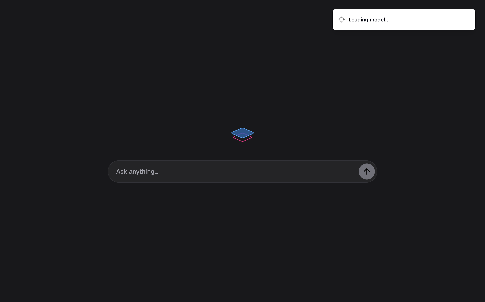

# Web Chat Demo



This is a tiny project demonstrating running an open-source LLM from HuggingFace in the browser. We use [Muna](https://muna.ai) 
to compile a Python function that runs an LLM; then vibe-code a chat UI in Next.js to run it.

## Setup Instructions
Sign up on [Muna](https://muna.ai) then [create an access key](https://www.muna.ai/settings/developer) and paste it in your `.env.local` file:
```sh
# Muna
MUNA_ACCESS_KEY="<your access key here>"
```

Next, install all Python packages:
```sh
# Install Node modules
$ npm install
```

Finally, start the development server:
```sh
# Run this in Terminal
$ npm run dev
```

And open the website in your browser.

## How it Works
Muna compiles the Python chat function in [`chat.py`](chat.py) into self-contained binaries that run across different platforms. 
At runtime, we use the Muna client's mock-OpenAI interface to run the model:
```js
// Create a streaming chat completion
const stream = await muna.beta.chat.completions.create({
  model: "@yusuf/gemma-3-270m",
  messages: [
    { role: "user", content: trimmed }
  ],
  stream: true
});

// Consume completion chunks
for await (const chunk of stream) {
    const token = chunk?.choices?.[0]?.delta?.content ?? "";
    ...
}
```

## Trying Different LLMs
The [chat.py](chat.py) Python script contains a minimal function that uses the 
[`llama-cpp-python`](https://github.com/abetlen/llama-cpp-python) library to run an LLM. You can update it to fetch a 
different LLM from HuggingFace; or a local `*.gguf` model file.

Once updated, first install Muna for Python:
```sh
# Run this in Terminal
$ pip install -r requirements.txt
```

Then modify `chat.py`, specifically the `@compile` decorator, with your Muna username:
```diff
# Define the chat function
@compile(
-    tag="@yusuf/gemma-3-270m",
+    tag="@username/gemma-3-270m"
    ...
)
```

Finally, compile `chat.py` with Muna:
```sh
# Run this in Terminal
$ muna compile --overwrite chat.py
```

## Resources
- See the [Muna documentation](https://docs.muna.ai).